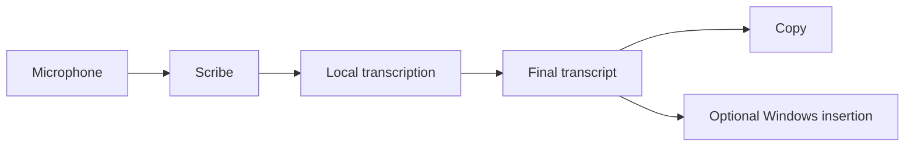

<h1 align="center">
  <picture>
    <source media="(prefers-color-scheme: dark)" srcset="docs/assets/branding/scribe-header-dark.svg" />
    
  </picture>
</h1>

<strong>Lightning-fast local transcription that stays out of your way.</strong>

**Local-first speech-to-text for your desktop.** Scribe records from your microphone, transcribes on your device, and leaves the finished text ready to copy or, on Windows when enabled, insert into the app you were using.

  
  
  

Windows x64 is the current release target. The first two badges download the latest installer or portable ZIP directly; the [GitHub Releases page](https://github.com/tyhuang9/scribe/releases) lists versioned files and release notes. The installer is currently unsigned, so verify that it came from the Scribe release page before continuing. It includes the English Base model; add other models inside Scribe.

## Start here

1. Install Scribe, then open it.
2. In **Models**, choose the included model, install a trusted model, or add a compatible local GGUF model.
3. In **Transcribe**, select the model and press **Start recording**.
4. Speak normally, then stop recording. Copy the final transcript or enable Windows insertion in Settings.

Scribe keeps microphone audio and transcription on your device. It has no account, sync service, or cloud speech-to-text service.

## See it in action

The animation uses a prerecorded audio clip. Its recording and finalization timing is staged for clarity, while the displayed text is generated locally from that clip. In regular use, Scribe can show a tentative preview while you speak, then creates a final transcript when recording stops. Only that final text can be copied or inserted.

## Everyday controls

| What you want to do | Where to do it |
| --- | --- |
| Start or stop dictation | **Transcribe** → **Start/Stop recording** |
| Use the default shortcut | `Ctrl+Shift+Space` (change it in **General**) |
| Choose toggle or hold-to-talk | **General** → **Hotkey mode** |
| Choose your microphone and check its level | **General** → **Audio** |
| Install, select, or import a model | **Models** |
| Copy or clear a completed transcript | **Transcribe** → **Copy** or **Clear** |
| Review transcripts you have chosen to retain | **History** |
| Fully quit after closing to the tray | Use the tray menu → **Quit** |

The in-app Start/Stop button is the dependable alternative if a desktop environment does not allow the global shortcut. On Windows, automatic insertion is optional and falls back to the clipboard when the target app cannot be used safely. Linux and macOS use the clipboard-only path.

## What to expect

- **Models are experimental.** An installable model is not yet a Supported model; the current Supported count is zero.
- **Windows is the release-qualified platform.** Linux and macOS retain conservative source-build fallbacks, but they are not release-qualified.
- **Permissions stay in your control.** Your operating system may ask for microphone access; macOS may also require Input Monitoring. Windows insertion is off until you enable it.

For a guided first run, platform notes, troubleshooting, and model help, visit the [Scribe documentation](https://tyhuang9.github.io/scribe/).

## How it works

Scribe is a native Rust desktop app built with egui/eframe. It captures microphone audio locally, prepares it in native workers, runs the selected model through a private local runtime boundary, and only sends the completed transcript to copy, history, overlay, or optional insertion.

## For contributors

- [Run Scribe from source](https://tyhuang9.github.io/scribe/install-and-run/)
- [Development guide](https://tyhuang9.github.io/scribe/development/)
- [Technical overview](docs/TECHNICAL_OVERVIEW.md)
- [Current project status](https://tyhuang9.github.io/scribe/project-status/)

The technical overview and implementation records describe model validation, runtime boundaries, release packaging, architecture checks, and outstanding verification work.
